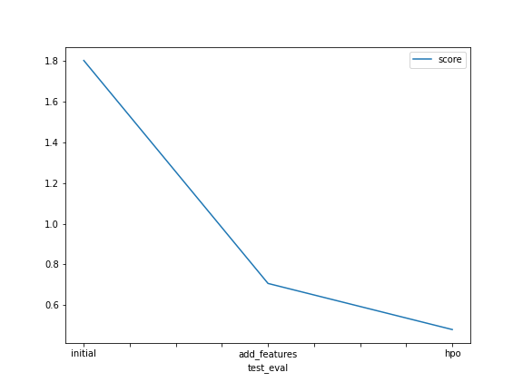

# Report: Predict Bike Sharing Demand with AutoGluon Solution
#### NAME HERE

## Initial Training
### What did you realize when you tried to submit your predictions? What changes were needed to the output of the predictor to submit your results?
During a few submissions model performance was improved, score have been less after doing EDA it is improved better. Also its was required to check output of the predictor, whether there is no negative values in predictions, in that case to set them to zero.
### What was the top ranked model that performed?
**WeightedEnsemble_L3** with hpo tuning is the top ranked model   

## Exploratory data analysis and feature creation
### What did the exploratory analysis find and how did you add additional features?
In EDA I have explored data by vizualization of some plots, like heat map where have been discovered high correlation in input variables('season' and 'month', 'temp' and 'atemp') and removed a input in each pair.   Another influence for performance was made adding more features by considering whether part of day('hour')

### How much better did your model preform after adding additional features and why do you think that is?
Before EDA my kaggle score is 1.8 after that I see it is improved as **0.7** even without hpo.

## Hyper parameter tuning
### How much better did your model preform after trying different hyper parameters?
After applying HPO kaggle score show my improvement that is **0.47**.

### If you were given more time with this dataset, where do you think you would spend more time?
I guess for getting better model performance its needed more time for feature engineering.

### Create a table with the models you ran, the hyperparameters modified, and the kaggle score.
|model|Time Limit|num_trials|search_strategy|score|
|--|--|--|--|--|
|initial|600||1|random|1.80367
|add_features|600|?|1|random|0.70660
|hpo|600|?|5|auto|0.47974

### Create a line plot showing the top model score for the three (or more) training runs during the project.

### Create a line plot showing the top kaggle score for the three (or more) prediction submissions during the project.

## Summary
Before this project I am not aware of AutoGluon now I got knowledge on this. and came to know that hyperparameters plays the major role in the model tuning
